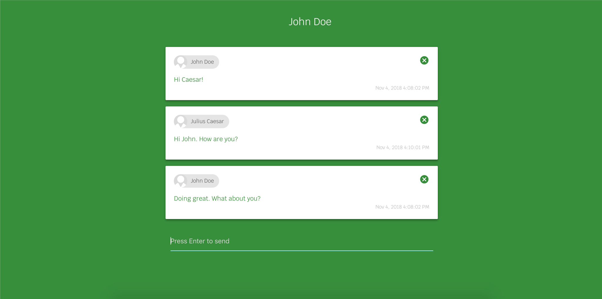

# Chat-Room

A simple chat application

## How it works

A user can join the chat room providing a username and he/she can send chat messages to other users who have also joined the chat room.

When a user joins to the chat room a socket io connection will be established between the client and the server, and when a user sends a chat message, it will emit a chat message event and the event listener on the server will capture it. Upon the event capturing, the server will emit that event and all event listeners on the clients including the client of the user who initiated the message will capture it. That way all chat history will be available for all the clients and the chat window will be populated with the messages. Users can also delete the messages they have sent and it is implemented in the same way mentioned above.

## Design

This application consists of two main UI components. A user login and a chat window.

Following are some screenshots of the application.

This Application is hosted in Heroku and can be accessed via the following URL.

https://v-chat-room.herokuapp.com

## Technology Stack

UI and Frontend

* AngularJS 1.7 (ES6)
* Materialize

BFF (Backend for Frontend)

* NodeJS
* Socket.io

Code Quality

* ESLint

CI/Build Tools

* Gulp (babel transpile, uglify sources for production)
* Heroku - [https://v-chat-room.herokuapp.com](https://v-chat-room.herokuapp.com)

Version Control

* Git - [https://github.com/vishmimoney/Chat-App](https://github.com/vishmimoney/Chat-App)

## Deploying the application locally

* Clone the repository.
* Make sure you have node and npm installed. (note that the node version 8.11.1 and npm version 6.2.0 are preferred)
* Run the command `npm install` to install all dependencies.
* Run the command `node server` to start the server.
* Go to http://localhost:8080 to access the application.

## Potential Improvements

* User authentication with proper session management. The current implementation uses only client-side cookies for user identification.
* Data persistence (Chat history, Logged in users etc.)
* Implement the capability to have multiple chat rooms
* Provide user logout capability. This will be required when a proper user authentication mechanism is implemented.
* Edit message (If necessary)
* Delete message capability can be enhanced to provide the capability to remove (hide) other users' messages only from logged in user's chat window. In the current implementation, users can only delete the messages they have sent.
