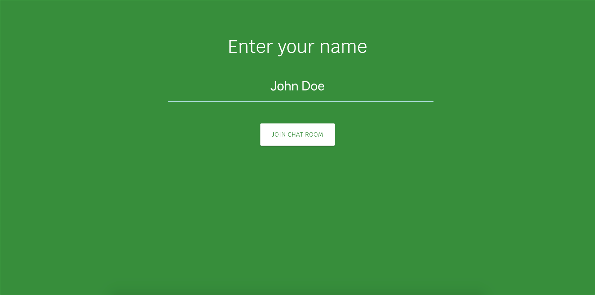

# Chat-Room

A simple chat application

## How it works

A user can log in to the chat room providing a username. It enables the user to chat with the other users who have also joined the chat room.

## Design

This application consists of two main UI components. A user login and a chat window.

Following are some screenshots of the application.

This Application is hosted in Heroku and can be accessed via the following URL.

https://v-chat-room.herokuapp.com

## Technology Stack

UI and Frontend

* AngularJS 1.7 (ES6)
* Materialize

BFF (Backend for Frontend)

* NodeJS

Code Quality

* ESLint

CI/Build Tools

* Gulp (babel transpile, uglify sources for production)
* Heroku - [https://v-chat-room.herokuapp.com](https://v-chat-room.herokuapp.com)

Version Control

* Git - [https://github.com/vishmimoney/Chat-App](https://github.com/vishmimoney/Chat-App)

## Potential Improvements

* Proper user authentication with proper session management. The current implementation uses only client-side cookies for user identification.
* Data persistence (Chat history, Logged in users etc.)
* Implement the capability to have multiple chat rooms

